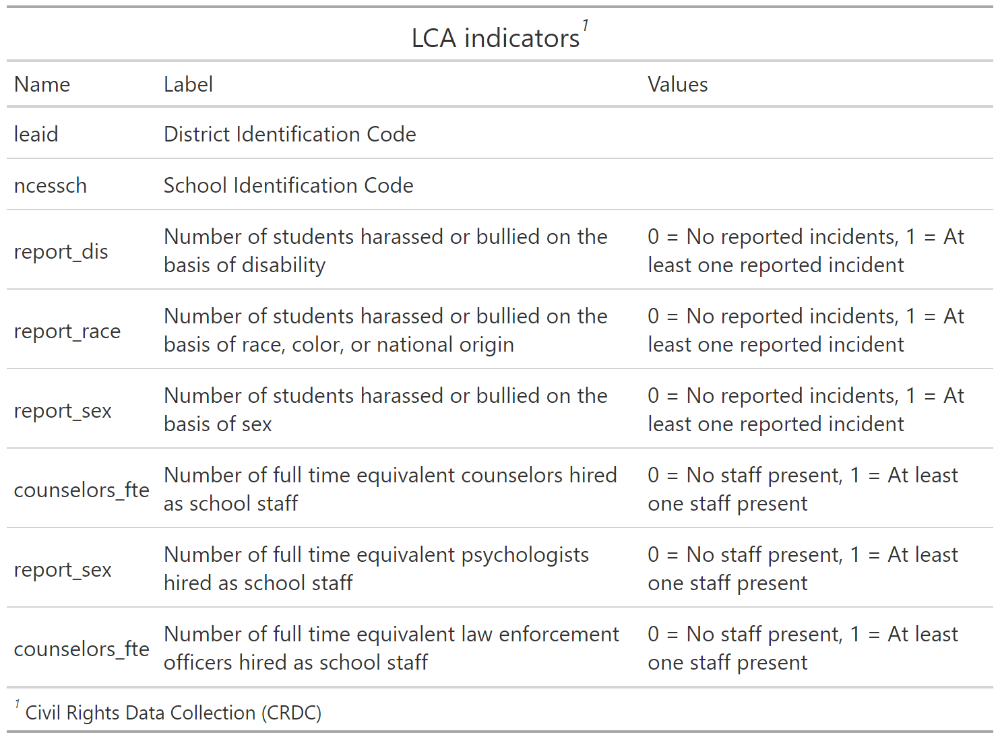

## Video tutorial repository: "lca_enum"

- - -

### An Introduction to R and RStudio

#### IMMERSE Project: Institute of Mixture Modeling for Equity-Oriented Researchers, Scholars, and Educators

#### Video Series Funded by IES Training Grant (R305B220021)

#### *Dina Arch*

- - -

# IMMERSE Project


The Institute of Mixture Modeling for Equity-Oriented Researchers, Scholars, and Educators (IMMERSE) is an IES funded training grant (R305B220021) to support Education scholars in integrating mixture modeling into their research.

-   Please [visit our website](https://immerse.education.ucsb.edu/) to learn more and apply for the year-long fellowship.

-   Follow us on [Twitter](https://twitter.com/IMMERSE_UCSB)!

How to reference this walkthrough: *This work was supported by the IMMERSE Project* (IES - 305B220021)

Visit our [GitHub](https://github.com/immerse-ucsb) account to download the materials needed for this walkthrough.

------------------------------------------------------------------------

## Example: Bullying in Schools 

------------------------------------------------------------------------


To demonstrate mixture modeling in the training program and online resource components of the IES grant we utilize the *Civil Rights Data Collection (CRDC)* (CRDC) data repository. The CRDC is a federally mandated school-level data collection effort that occurs every other year. This public data is currently available for selected latent class indicators across 4 years (2011, 2013, 2015, 2017) and all US states. In this example, we use the Arizona state sample. We utilize six focal indicators which constitute the latent class model in our example; three variables which report on harassment/bullying in schools based on disability, race, or sex, and three variables on full-time equivalent school staff hires (counselor, psychologist, law enforcement). This data source also includes covariates on a variety of subjects and distal outcomes reported in 2018 such as math/reading assessments and graduation rates. 

------------------------------------------------------------------------

Load packages

```{r, cache = FALSE}

library(tidyverse)
library(haven)
library(glue)
library(MplusAutomation)
library(here)
library(janitor)
library(gt)
library(cowplot)
library(DiagrammeR) 
here::i_am("lca_enum.Rmd")
```

### Variable Description

```{r, echo=FALSE, eval=TRUE}
tribble(
   ~"Name",      ~"Label",  ~"Values",                                   
#--------------|--------------------------------|-----|,
  "leaid",   "District Identification Code", "",
  "ncessch",   "School Identification Code", "",
  "report_dis",   "Number of students harassed or bullied on the basis of disability",  "0 = No reported incidents, 1 = At least one reported incident",
  "report_race",  "Number of students harassed or bullied on the basis of race, color, or national origin",  "0 = No reported incidents, 1 = At least one reported incident",
  "report_sex", "Number of students harassed or bullied on the basis of sex",  "0 = No reported incidents, 1 = At least one reported incident",
  "counselors_fte", "Number of full time equivalent counselors hired as school staff",  "0 = No staff present, 1 = At least one staff present",  
  "report_sex", "Number of full time equivalent psychologists hired as school staff",  "0 = No staff present, 1 = At least one staff present",
  "counselors_fte", "Number of full time equivalent law enforcement officers hired as school staff",  "0 = No staff present, 1 = At least one staff present") %>% 
gt() %>% 
  tab_header(
    title = "LCA indicators"  # Add a title
    ) %>%
  tab_options(
    table.width = pct(75)
  ) %>%
  tab_footnote(
    footnote = "Civil Rights Data Collection (CRDC)",
    location = cells_title()) %>% 
  gtsave("figures/info.png")
```



------------------------------------------------------------------------

**Variables have been transformed to be dichotomous indicators using the following coding strategy**

Harassment and bullying count variables are recoded `1` if the school reported at least one incident of harassment (`0` indicates no reported incidents).
On the original scale reported by the CDRC staff variables for full time equivalent employees (FTE) are represented as `1` and part time employees are represented by values between `1` and `0`.
Schools with greater than one staff of the designated type are represented by values greater than 1.
All values greater than zero were recorded as `1s` (e.g., `.5`, `1`,`3`) indicating that the school has a staff present on campus at least part time.
Schools with no staff of the designated type are indicated as `0` for the dichotomous variable.

------------------------------------------------------------------------

```{r, echo=FALSE, eval=TRUE, fig.align='center'}

grViz(" digraph cfa_model {

# The `graph` statement - No editing needed

    graph [layout = dot, overlap = true]
 
# Two `node` statements
 
# One for measured variables (box) 

    node [shape=box]
    report_dis report_race report_sex counselors_fte psych_fte law_fte;
 
# One for latent variables (circle) 
 
    node [shape=circle]
    bully [label=<Bullying <br/>C<sub>k</sub>>];
    
# `edge` statements
 
    edge [minlen = 2]
    bully -> {report_dis report_race report_sex counselors_fte psych_fte law_fte}
 
 }") 
```

------------------------------------------------------------------------

### Prepare Data

```{r, eval=TRUE}
df_bully <- read_csv(here("data", "crdc_lca_data.csv")) %>% 
  clean_names() %>% 
  dplyr::select(report_dis, report_race, report_sex, counselors_fte, psych_fte, law_fte) 
```

------------------------------------------------------------------------

### Descriptive Statistics

```{r}
# Set up data to find proportions of binary indicators
ds <- df_bully %>% 
  pivot_longer(c(report_dis, report_race, report_sex, counselors_fte, psych_fte, law_fte), names_to = "variable") 


# Create table of variables and counts, then find proportions and round to 3 decimal places
prop_df <- ds %>%
  count(variable, value) %>%
  group_by(variable) %>%
  mutate(prop = n / sum(n)) %>%
  ungroup() %>%
  mutate(prop = round(prop, 3))


# Make it a gt() table
prop_table <- prop_df %>% 
  gt(groupname_col = "variable", rowname_col = "value") %>%
  tab_stubhead(label = md("*Values*")) %>%
  tab_header(
    md(
      "Variable Proportions"
    )
  ) %>%
  cols_label(
    variable = md("*Variable*"),
    value = md("*Value*"),
    n = md("*N*"),
    prop = md("*Proportion*")
  ) 
  
prop_table

# Save as img
gtsave(prop_table, here("figures", "prop_table.png"))
```

------------------------------------------------------------------------

### Quick Introduction to `MplusAutomation`


**WHAT?**

-   `MplusAutomation` is an `R` package
-   It "wraps around" the `Mplus` program
-   Requires both `R` & `Mplus` software
-   Requires learning some basics of 2 programming languages
-   Car metaphor: R/Rstudio is the *steering wheel or dashboard* & Mplus is the *engine*

**WHY?**

-   `MplusAutomation` can provide clearly organized work procedures in which every research decision can be documented in a single place
-   Increase reproducibility, organization, efficiency, and transparency

**HOW?**

-   The interface for MplusAutomation is entirely within R-Studio. You do not need to open Mplus
-   The code presented will be very repetitive by design

Below is a template for `mplusObject()` & `mplusModeler()` functions. Use this template to run statistical models with Mplus. 

```{r, eval = FALSE}

m_template  <- mplusObject(
  
  TITLE = 
    "", 
  
  VARIABLE = 
    "",
  
  ANALYSIS = 
    "",
  
  PLOT = 
    "",
  
  OUTPUT = 
    "",
 
  usevariables = colnames(), 
  rdata =  )

m_template_fit <- mplusModeler(m_template, 
                  dataout=here("", ".dat"),
                  modelout=here("", ".inp"),
                  check=TRUE, run = TRUE, hashfilename = FALSE)

```


### Enumeration

This code uses the `mplusObject` function in the `MplusAutomation` package and saves all model runs in the `enum` folder.

```{r, cache = TRUE}

lca_6  <- lapply(1:6, function(k) {
  lca_enum  <- mplusObject(
      
    TITLE = glue("{k}-Class"), 
  
    VARIABLE = glue(
    "categorical = report_dis-law_fte; 
     usevar = report_dis-law_fte;
     classes = c({k}); "),
  
  ANALYSIS = 
   "estimator = mlr; 
    type = mixture;
    starts = 200 100; 
    processors = 10;",
  
  OUTPUT = "sampstat residual tech11 tech14;",
  
  PLOT = 
    "type = plot3; 
    series = report_dis-law_fte(*);",
  
  usevariables = colnames(df_bully),
  rdata = df_bully)

lca_enum_fit <- mplusModeler(lca_enum, 
                            dataout=glue(here("enum", "bully.dat")),
                            modelout=glue(here("enum", "c{k}_bully.inp")) ,
                            check=TRUE, run = TRUE, hashfilename = FALSE)
})

```

**IMPORTANT**: Before moving forward, make sure to open each output document to ensure models were estimated normally. In this example, the last two models (5- and 6-class models) did not produce reliable output and are excluded.

------------------------------------------------------------------------

### Table of Fit

First, extract data:

```{r}
# 
output_bully <- readModels(here("enum"), filefilter = "bully", quiet = TRUE)

enum_extract <- LatexSummaryTable(
  output_bully,
  keepCols = c(
    "Title",
    "Parameters",
    "LL",
    "BIC",
    "aBIC",
    "BLRT_PValue",
    "T11_VLMR_PValue",
    "Observations"
  ),
  sortBy = "Title"
) %>% 
  slice_head(n=4) # Select first four models (Class 1 through 4)


allFit <- enum_extract %>%
  mutate(CAIC = -2 * LL + Parameters * (log(Observations) + 1)) %>%
  mutate(AWE = -2 * LL + 2 * Parameters * (log(Observations) + 1.5)) %>%
  mutate(SIC = -.5 * BIC) %>%
  mutate(expSIC = exp(SIC - max(SIC))) %>%
  mutate(BF = exp(SIC - lead(SIC))) %>%
  mutate(cmPk = expSIC / sum(expSIC)) %>%
  dplyr::select(1:5, 9:10, 6:7, 13, 14) %>%
  arrange(Parameters)
```

Then, create table:

```{r}
fit_table1 <- allFit %>%
  gt() %>%
  tab_header(title = md("**Model Fit Summary Table**")) %>%
  cols_label(
    Title = "Classes",
    Parameters = md("Par"),
    LL = md("*LL*"),
    T11_VLMR_PValue = "VLMR",
    BLRT_PValue = "BLRT",
    BF = md("BF"),
    cmPk = md("*cmPk*")
  ) %>%
  tab_footnote(
    footnote = md(
      "*Note.* Par = Parameters; *LL* = model log likelihood;
BIC = Bayesian information criterion;
aBIC = sample size adjusted BIC; CAIC = consistent Akaike information criterion;
AWE = approximate weight of evidence criterion;
BLRT = bootstrapped likelihood ratio test p-value;
VLMR = Vuong-Lo-Mendell-Rubin adjusted likelihood ratio test p-value;
*cmPk* = approximate correct model probability."
    ),
locations = cells_title()
  ) %>%
  tab_options(column_labels.font.weight = "bold") %>%
  fmt_number(c(3:7),
             decimals = 2) %>%
  sub_missing(1:11,
              missing_text = "--") %>%
  fmt(
    c(8:9, 11),
    fns = function(x)
      ifelse(x < 0.001, "<.001",
             scales::number(x, accuracy = .01))
  ) %>%
  fmt(
    10,
    fns = function (x)
      ifelse(x > 100, ">100",
             scales::number(x, accuracy = .01))
  ) %>%  
  tab_style(
    style = list(
      cell_text(weight = "bold")
      ),
    locations = list(cells_body(
     columns = BIC,
     row = BIC == min(BIC[c(1:4)]) # Change this to the number of classes you estimated
    ),
    cells_body(
     columns = aBIC,
     row = aBIC == min(aBIC[1:4])
    ),
    cells_body(
     columns = CAIC,
     row = CAIC == min(CAIC[1:4])
    ),
    cells_body(
     columns = AWE,
     row = AWE == min(AWE[1:4])
    ),
    cells_body(
     columns = cmPk,
     row =  cmPk == max(cmPk[1:4])
     ),    
    cells_body(
     columns = BF,
     row =  BF > 10),
    cells_body( 
     columns =  T11_VLMR_PValue,
     row =  ifelse(T11_VLMR_PValue < .001 & lead(T11_VLMR_PValue) > .05, T11_VLMR_PValue < .001, NA)),
    cells_body(
     columns =  BLRT_PValue,
     row =  ifelse(BLRT_PValue < .001 & lead(BLRT_PValue) > .05, BLRT_PValue < .001, NA))
  )
)

fit_table1
```

------------------------------------------------------------------------

Save table:

```{r, eval = FALSE}
gtsave(fit_table1, here("figures", "fit_table1.png"))
```

------------------------------------------------------------------------

### Information Criteria Plot

```{r height=5, width=7}
allFit %>%
  dplyr::select(2:7) %>%
  rowid_to_column() %>%
  pivot_longer(`BIC`:`AWE`,
               names_to = "Index",
               values_to = "ic_value") %>%
  mutate(Index = factor(Index,
                        levels = c ("AWE", "CAIC", "BIC", "aBIC"))) %>%
  ggplot(aes(
    x = rowid,
    y = ic_value,
    color = Index,
    shape = Index,
    group = Index,
    lty = Index
  )) +
  geom_point(size = 2.0) + geom_line(size = .8) +
  scale_x_continuous(breaks = 1:nrow(allFit)) +
  scale_colour_grey(end = .5) +
  theme_cowplot() +
  labs(x = "Number of Classes", y = "Information Criteria Value", title = "Information Criteria") +
  theme(
    text = element_text(family = "serif", size = 12),
    legend.text = element_text(family="serif", size=12),
    legend.key.width = unit(3, "line"),
    legend.title = element_blank(),
    legend.position = "top"  
  )
```

------------------------------------------------------------------------

Save figure:

```{r}
ggsave(here("figures", "info_criteria.png"), dpi=300, height=5, width=7, units="in")
```

------------------------------------------------------------------------

### Compare Class Solutions

Compare probability plots for $K = 1:6$ class solutions

```{r}
model_results <- data.frame()

for (i in 1:length(output_bully)) {
  
  temp <- output_bully[[i]]$parameters$probability.scale %>%                                       
    mutate(model = paste(i,"-Class Model"))                                                  
  
  model_results <- rbind(model_results, temp)
}

rm(temp)

compare_plot <-
  model_results %>%
  filter(category == 2) %>%
  dplyr::select(est, model, LatentClass, param) %>%
  mutate(param = as.factor(str_to_lower(param))) 

compare_plot$param <- fct_inorder(compare_plot$param)

ggplot(
  compare_plot,
  aes(
    x = param,
    y = est,
    color = LatentClass,
    shape = LatentClass,
    group = LatentClass,
    lty = LatentClass
  )
) +
  geom_point() + 
  geom_line() +
  scale_colour_viridis_d() +
  facet_wrap( ~ model, ncol = 2) +
  labs(title = "Bullying Items",
       x = " ", y = "Probability") +
  theme_minimal() +
  theme(panel.grid.major.y = element_blank(),
                          axis.text.x = element_text(angle = -45, hjust = -.1))                            
```

------------------------------------------------------------------------

Save figure:

```{r, eval = FALSE}
ggsave(here("figures", "compare_kclass_plot.png"), dpi=300, height=5, width=7, units="in")
```

------------------------------------------------------------------------

### 3-Class Probability Plot

Use the `plot_lca` function provided in the folder to plot the item probability plot. This function requires one argument:
- `model_name`: The name of the Mplus `readModels` object (e.g., `output_bully$c3_bully.out`)

```{r fig.height=6, fig.width=10}
source("plot_lca.txt")

plot_lca(model_name = output_bully$c3_bully.out)
```

------------------------------------------------------------------------

Save figure:

```{r, eval = FALSE}
ggsave(here("figures", "C3_bully_LCA_Plot.png"), dpi="retina", height=5, width=7, units="in")
```

------------------------------------------------------------------------

### Observed Response Patterns

Save response frequencies for the 3-class model from the previous lab with `response is _____.dat` under `SAVEDATA.`

```{r, cache = TRUE}

patterns  <- mplusObject(
  
  TITLE = "C3 LCA - Save response patterns", 
  
  VARIABLE = 
  "categorical = report_dis-law_fte; 
   usevar =  report_dis-law_fte;
   classes = c(3);",
  
  ANALYSIS = 
   "estimator = mlr; 
    type = mixture;
    starts = 0;
    processors = 10;
    optseed = 802779;",
  
  SAVEDATA = 
   "File=savedata.dat;
    Save=cprob;
    
    ! Code to save response frequency data 
    
    response is resp_patterns.dat;",
  
  OUTPUT = "residual patterns tech10 tech11 tech14",
  
  usevariables = colnames(df_bully),
  rdata = df_bully)

patterns_fit <- mplusModeler(patterns,
                dataout=here("mplus", "bully.dat"),
                modelout=here("mplus", "patterns.inp") ,
                check=TRUE, run = TRUE, hashfilename = FALSE)
```

Note: You may see an error that says `<simpleError in bivarFitData[mPos, ] <- c(vars, values): number of items to replace is not a multiple of replacement length>`, the developers are aware of this and are working to fix it.

------------------------------------------------------------------------

Read in observed response pattern data and relabel the columns

```{r}
# Read in response frequency data that we just created:
patterns <- read_table(here("mplus", "resp_patterns.dat"),
                        col_names=FALSE, na = "*") 

# Extract the column names
names <- names(readModels(here("mplus", "patterns.out"))[['savedata']])

# Add the names back to the dataset
colnames(patterns) <- c("Frequency", names)  
```

Create a table with the top 5 unconditional response pattern, then top of conditional response pattern for each modal class assignment

```{r,eval=TRUE}
# Order responses by highest frequency
order_highest <- patterns %>% 
  arrange(desc(Frequency)) 

# Loop `patterns` data to list top 5 conditional response patterns for each class
loop_cond  <- lapply(1:max(patterns$C), function(k) {       
order_cond <- patterns %>%                    
  filter(C == k) %>%                    
  arrange(desc(Frequency)) %>%                
  head(5)                                     
  })                                          

# Convert loop into data frame
table_data <- as.data.frame(bind_rows(loop_cond))

# Combine unconditional and conditional responses patterns
response_patterns <-  rbind(order_highest[1:5,], table_data) 
```

Finally, use `{gt}` to make a nicely formatted table

```{r}
resp_table <- response_patterns %>% 
  gt() %>%
    tab_header(
    title = "Observed Response Patterns",
    subtitle = html("Response patterns, estimated frequencies, estimated posterior class probabilities and modal assignments")) %>% 
    tab_source_note(
    source_note = md("Data Source: **Civil Rights Data Collection (CRDC)**")) %>%
    cols_label(
      Frequency = html("<i>f</i><sub>r</sub>"),
    REPORT_D = "Harrassment: Disability",
    REPORT_R = "Harrassment: Race",
    REPORT_S = "Harrassment: Sex",
    COUNSELO = "Staff: Counselor",
    PSYCH_FT = "Staff: Psychologist",
    LAW_FTE = "Staff: Law Enforcement",
    CPROB1 = html("P<sub><i>k</i></sub>=1"),
    CPROB2 = html("P<sub><i>k</i></sub>=2"),
    CPROB3 = html("P<sub><i>k</i></sub>=3"),
    C = md("*k*")) %>% 
  tab_row_group(
    label = "Unconditional response patterns",
    rows = 1:5) %>%
  tab_row_group(
    label = md("*k* = 1 Conditional response patterns"),
    rows = 6:10) %>% #EDIT THESE VALUES BASED ON THE LAST COLUMN
  tab_row_group(
    label = md("*k* = 2 Conditional response patterns"),
    rows = 11:15)  %>% #EDIT THESE VALUES BASED ON THE LAST COLUMN
  tab_row_group(
    label = md("*k* = 3 Conditional response patterns"),
    rows = 16:20)  %>% #EDIT THESE VALUES BASED ON THE LAST COLUMN  
    row_group_order(
      groups = c("Unconditional response patterns",
                 md("*k* = 1 Conditional response patterns"),
                 md("*k* = 2 Conditional response patterns"),
                 md("*k* = 3 Conditional response patterns"))) %>% 
    tab_footnote(
    footnote = html(
      "<i>Note.</i> <i>f</i><sub>r</sub> = response pattern frequency; P<sub><i>k</i></sub> = posterior class probabilities"
    )
  ) %>% 
  cols_align(align = "center") %>% 
  opt_align_table_header(align = "left") %>% 
  gt::tab_options(table.font.names = "Times New Roman")

resp_table
```

------------------------------------------------------------------------

Save table:

```{r}
gtsave(resp_table, here("figures","resp_table.png"))

```

------------------------------------------------------------------------

### Classification Diagnostics

Use Mplus to calculate k-class confidence intervals (Note: Change the synax to make your chosen *k*-class model):

```{r, cache = TRUE}
classification  <- mplusObject(
  
  TITLE = "C3 LCA - Calculated k-Class 95% CI",
  
  VARIABLE =
    "categorical = report_dis-law_fte;
   usevar =  report_dis-law_fte;
   classes = c(3);", 
  
  ANALYSIS =
    "estimator = ml;
    type = mixture;
    starts = 0; 
    processors = 10;
    stseed = 802779;
    bootstrap = 1000;",
  
  MODEL =
    "
  !CHANGE THIS SECTION TO YOUR CHOSEN k-CLASS MODEL
    
  %OVERALL%
  [C#1](c1);
  
  [C#2](C2);

  Model Constraint:
  New(p1 p2 p3);
  
  p1 = exp(c1)/(1+exp(c1)+exp(c2));
  p2 = exp(c2)/(1+exp(c1)+exp(c2));
  p3 = 1/(1+exp(c1)+exp(c2));",

  
  OUTPUT = "cinterval(bcbootstrap)",
  
  usevariables = colnames(df_bully),
  rdata = df_bully)

classification_fit <- mplusModeler(classification,
                dataout=here("mplus", "bully.dat"),
                modelout=here("mplus", "class.inp") ,
                check=TRUE, run = TRUE, hashfilename = FALSE)
```

------------------------------------------------------------------------

Read in the 3-class model:

```{r}
# Read in the 3-class model and extract information needed
output_bully <- readModels(here("mplus", "class.out"))

# Entropy
entropy <- c(output_bully$summaries$Entropy, rep(NA, output_bully$summaries$NLatentClasses-1))

# 95% k-Class and k-class 95% Confidence Intervals
k_ci <- output_bully$parameters$ci.unstandardized %>% 
  filter(paramHeader == "New.Additional.Parameters") %>% 
  unite(CI, c(low2.5,up2.5), sep=", ", remove = TRUE) %>% 
  mutate(CI = paste0("[", CI, "]")) %>% 
  rename(kclass=est) %>% 
  dplyr::select(kclass, CI)

# AvePPk = Average Latent Class Probabilities for Most Likely Latent Class Membership (Row) by Latent Class (Column)
avePPk <- tibble(avePPk = diag(output_bully$class_counts$avgProbs.mostLikely))

# mcaPk = modal class assignment proportion 
mcaPk <- round(output_bully$class_counts$mostLikely,3) %>% 
  mutate(model = paste0("Class ", class)) %>% 
  add_column(avePPk, k_ci) %>% 
  rename(mcaPk = proportion) %>% 
  dplyr::select(model, kclass, CI, mcaPk, avePPk)

# OCCk = odds of correct classification
OCCk <- mcaPk %>% 
  mutate(OCCk = round((avePPk/(1-avePPk))/(kclass/(1-kclass)),3))

# Put everything together
class_table <- data.frame(OCCk, entropy)
```

Now, use `{gt}` to make a nicely formatted table

```{r}
class_table <- class_table %>% 
  gt() %>%
    tab_header(
    title = "Model Classification Diagnostics for the 3-Class Solution") %>%
    cols_label(
      model = md("*k*-Class"),
      kclass = md("*k*-Class Proportions"),
      CI = "95% CI",
      mcaPk = html("McaP<sub>k</sub>"),
      avePPk = md("AvePP<sub>k</sub>"),
      OCCk = md("OCC<sub>k</sub>"),
      entropy = "Entropy") %>% 
    sub_missing(7,
              missing_text = "") %>%
    tab_footnote(
    footnote = html(
      "<i>Note.</i> McaP<sub>k</sub> = Modal class assignment proportion; AvePP<sub>k</sub> = Average posterior class probabilities; OCC<sub>k</sub> = Odds of correct classification; "
    )
  ) %>% 
  cols_align(align = "center") %>% 
  opt_align_table_header(align = "left") %>% 
  gt::tab_options(table.font.names = "Times New Roman")

class_table
```


------------------------------------------------------------------------

Save table:

```{r}
gtsave(class_table, here("figures","class_table.png"))

```


------------------------------------------------------------------------

## References

Hallquist, M. N., & Wiley, J. F.
(2018).
MplusAutomation: An R Package for Facilitating Large-Scale Latent Variable Analyses in Mplus.
Structural equation modeling: a multidisciplinary journal, 25(4), 621-638.

Muthén, B. O., Muthén, L. K., & Asparouhov, T.
(2017).
Regression and mediation analysis using Mplus.
Los Angeles, CA: Muthén & Muthén.

Muthén, L.K.
and Muthén, B.O.
(1998-2017).
Mplus User's Guide.
Eighth Edition.
Los Angeles, CA: Muthén & Muthén

R Core Team (2017).
R: A language and environment for statistical computing.
R Foundation for Statistical Computing, Vienna, Austria.
URL <http://www.R-project.org/>

Wickham et al., (2019).
Welcome to the tidyverse.
Journal of Open Source Software, 4(43), 1686, <https://doi.org/10.21105/joss.01686>

------------------------------------------------------------------------

{width="75%"}
